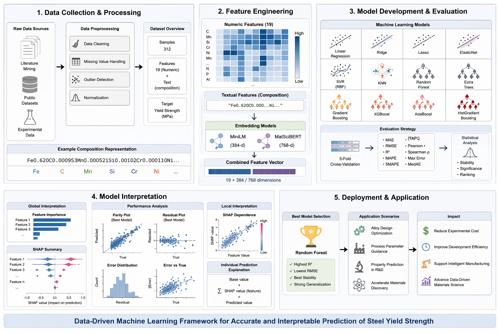
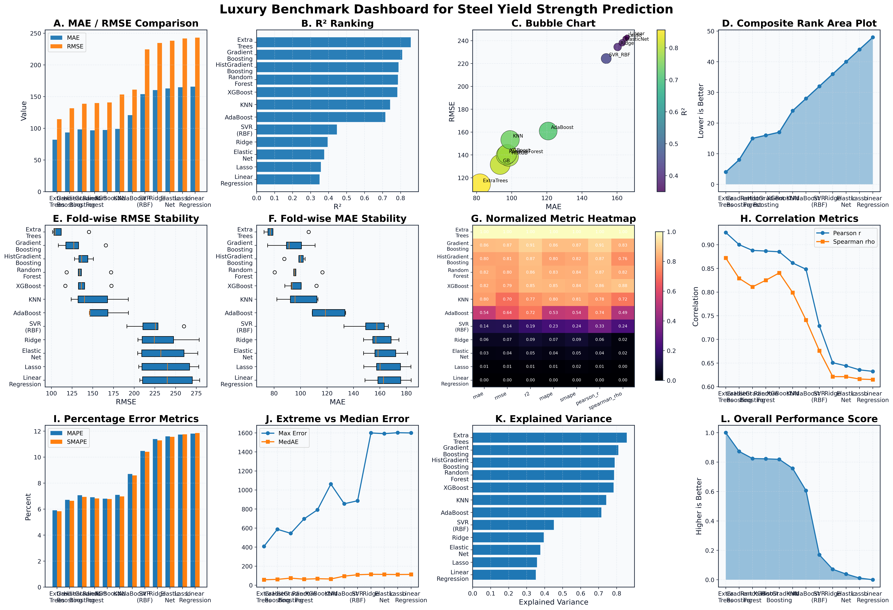
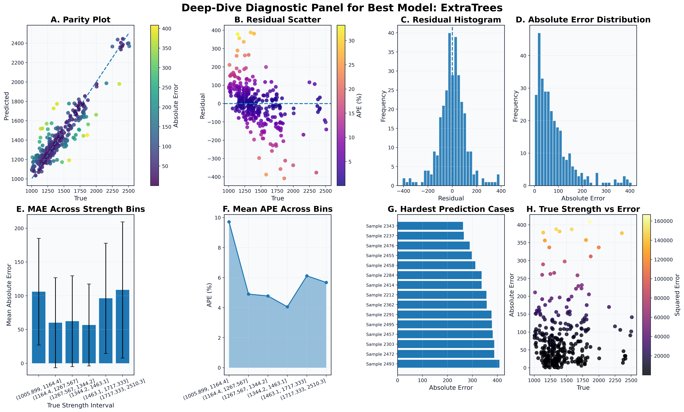
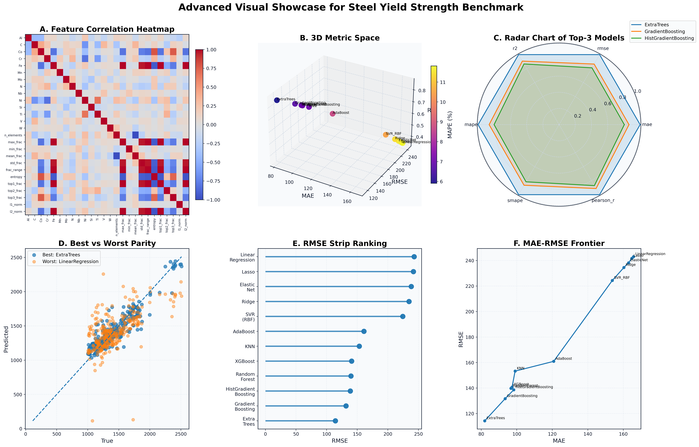

# MatSci-Strength

**Composition-Driven Benchmarking and Interpretable Prediction of Steel Yield Strength Using Classical Machine Learning**

## Overview

MatSci-Strength is a reproducible materials informatics project for predicting steel yield strength from alloy composition.  
The project benchmarks multiple classical regression models on the Matbench steel task and provides interpretable analysis through feature importance, residual diagnostics, and visual benchmarking dashboards.

This repository accompanies our paper on composition-based steel yield strength prediction and focuses on three goals:

- building a reproducible benchmark pipeline for small-sample steel property prediction
- comparing multiple regression models under a unified evaluation protocol
- interpreting model behavior through feature importance and diagnostic visualization

---

## Dataset

The experiments are based on the **Matbench steel** task.

- **Input**: alloy composition
- **Target**: yield strength
- **Samples**: 312
- **Feature space**: composition-derived numerical descriptors

---
<table>
  <tr>
    <td align="center">
       
      <b>Framework</b>
    </td>
    <td align="center">
       
      <b>Benchmark Dashboard</b>
    </td>
  </tr>
  <tr>
    <td align="center">
       
      <b>Best Model Diagnostics</b>
    </td>
    <td align="center">
       
      <b>Advanced Showcase</b>
    </td>
  </tr>
</table>

---
## Methods

We construct an enhanced composition-based descriptor space and benchmark the following regression models:

- LinearRegression
- Ridge
- Lasso
- ElasticNet
- SVR (RBF)
- KNN
- RandomForest
- ExtraTrees
- GradientBoosting
- HistGradientBoosting
- AdaBoost
- XGBoost

Evaluation is performed using **5-fold cross-validation** with multiple metrics including:

- MAE
- RMSE
- R²
- MAPE
- SMAPE
- Pearson correlation
- Spearman correlation

---

## Main Results

Among all evaluated methods, **ExtraTrees** achieved the best overall performance on the steel yield strength prediction task.

Representative findings include:

- tree-based ensemble models consistently outperform linear baselines
- ExtraTrees provides the best trade-off between accuracy and stability
- Ti, C, Si, and Mn are repeatedly identified as important compositional features
- composition-level statistical descriptors such as entropy also contribute meaningfully

---
